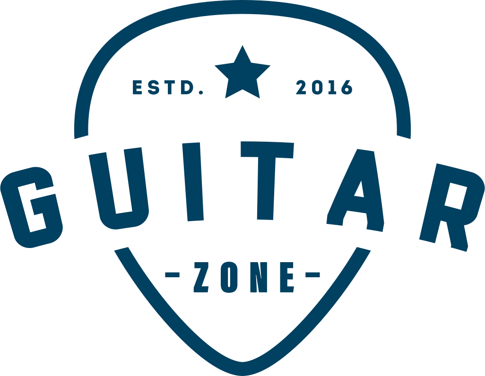

<p align="center">
  <a href="https://guitarzoneapp.herokuapp.com">
    
  </a>
</p>
<div align="center">
  <h1>Guitar Zone API</h1>
  <h3>A RESTful API created with the PostgreSQL open-source relational database and Sequelize ORM for use with Node.js and Express.</h3>
</div>

## About Guitar Zone API

Guitar Zone API is a RESTful API created with the PostgreSQL open-source relational database and Sequelize ORM for use with Node.js and Express.

## To Set Up Locally
You can take all the files of this site and run them on your computer as if it were live online, only it's just on your machine.

### Requirements
* [Git](http://git-scm.com/)
* [Node.js](https://nodejs.org/en/)
* [npm](https://www.npmjs.com)
* [Express](https://expressjs.com)
* [Sequelize](https://sequelize.org)
* [PostgreSQL](https://www.postgresql.org)
* [EJS](https://ejs.co)

To copy the repository's files from here onto your computer and to view and serve those files locally, at your computer's command line type:
```
git clone https://github.com/mvrad/guitar-zone-api.git
```
Then open the files in a text editor such as [Visual Studio Code](https://code.visualstudio.com/) and in the terminal type:
```bash
npm install
```
To install all of the project's dependencies. Then cd into the project's directory and start the application:
```bash
cd guitar-zone-api
nodemon
```
You should now be able to visit localhost:3000 in your browser.

## License
Guitar Zone API is licensed under the [MIT license](https://github.com/mvrad/guitar-zone-api/blob/master/LICENSE).